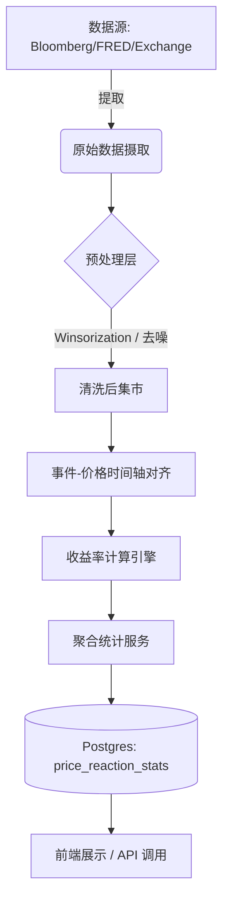

# Macro Historical Statistics System Design

构建一个可重复、可扩展、可审计的历史统计系统，用于分析宏观数据发布对资产价格的影响。

## 1. 核心流程 (Pipeline)



### 数据阶段说明：
1.  **Ingestion**: 拉取指标发布时间（Release Time）与实际值/预期值。
2.  **Alignment**: 以发布时间为 `T0`，匹配资产端对应的 VWAP 价格。
3.  **Calculation**: 计算 `T+1h`, `T+4h`, `T+24h` 窗口的收益率。
4.  **Aggregation**: 分类统计（Above/Inline/Below）并进行统计学处理（Median, Win Rate）。

---

## 2. 表结构设计 (Database Schema)

### 2.1 宏观指标元数据 (`macro_indicators`)
| 字段 | 类型 | 说明 |
| :--- | :--- | :--- |
| `id` | UUID | 主键 |
| `name` | String | 指标名称 (例如: CPI YoY) |
| `code` | String | 唯一代码 (例如: US_CPI_YOY) |
| `inline_threshold` | Decimal | 定义 Inline 的偏差阈值 |

### 2.2 历史发布记录 (`macro_history`)
| 字段 | 类型 | 说明 |
| :--- | :--- | :--- |
| `id` | UUID | 主键 |
| `indicator_id` | UUID | 关联指标 |
| `release_time` | Timestamp | 发布时间 (UTC) |
| `actual` | Decimal | 实际值 |
| `expected` | Decimal | 预期值 |
| `result_type` | Enum | ABOVE / INLINE / BELOW |

### 2.3 聚合统计结果 (`price_reaction_stats`)
| 字段 | 类型 | 说明 |
| :--- | :--- | :--- |
| `asset_id` | String | 资产代码 (例如: BTC) |
| `indicator_id` | UUID | 关联指标 |
| `result_type` | Enum | 结果分类 |
| `window` | String | 时间窗口 (1h, 4h, 24h) |
| `avg_return` | Decimal | 平均收益率 |
| `median_return` | Decimal | 中位数收益率 |
| `win_rate` | Decimal | 胜率 (上涨样本占比) |
| `sample_size` | Int | 样本数 |

---

## 3. 统计计算逻辑 (Pseudo-code)

```python
def process_macro_reaction(asset_id, indicator_id, windows=[1, 4, 24]):
    # 1. 获取该指标的所有历史发布
    history = db.query(MacroHistory).filter_by(indicator_id=indicator_id).all()
    
    raw_returns = []
    
    for event in history:
        # 获取 T0 (发布时刻) 的价格
        t0_price = get_vwap(asset_id, event.release_time)
        
        for w in windows:
            # 获取 T+w 的价格
            tn_price = get_vwap(asset_id, event.release_time + hours(w))
            
            if t0_price and tn_price:
                ret = (tn_price - t0_price) / t0_price
                raw_returns.append({
                    'type': event.result_type,
                    'window': f'{w}h',
                    'return': ret
                })

    # 2. 数据清洗: Winsorize (处理 1% & 99% 的极端异常值)
    # 3. 聚合计算
    stats = aggregate(raw_returns)
    
    # 4. 置信度判断
    for s in stats:
        s.reliability = 'HIGH' if s.sample_size >= 20 else 'LOW'
        
    return stats
```

---

## 4. 数据质量与审计

- **Winsorization**: 强制限制极端值，防止黑天鹅事件扭曲统计规律。
- **可回溯性**: `macro_history` 记录原始抓取日志和时间戳，确保结果可审计。
- **置信度标记**: 小样本（<10）仅供参考，不作为高权重决策依据。
